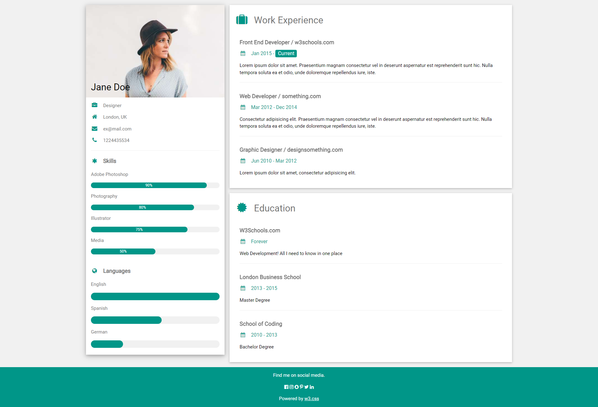

# Create your first portfolio

## Overview
Every frontend developer needs to have a portfolio to showcase the projects that they have made. This can be a source of job offers since it can easily show information about you as well as your experience.

## Instructions
1. Create the website you see in the screenshot below.
2. Don't start coding from the beginning. Break the website down like we do as developers. So that when you begin writing your HTML it can be made on a good basis without causing you much troubles.
3. Add your own flavour. This is **YOUR** portfolio. So add elements that speak about you.
4. Don't worry about finishing this on time. At the end, the activity is here to help you get started, but you will have to put more time into it after class.

## Hints
I know that the first thing you saw when you saw this page was the progress bar (the one in the skills section). You can use this [guide](https://css-tricks.com/css3-progress-bars/) to learn how to make it. There is a lot of things in that page, but focus mainly on HTML Base and Start of CSS sections.

## Screenshots
- Desktop version 
